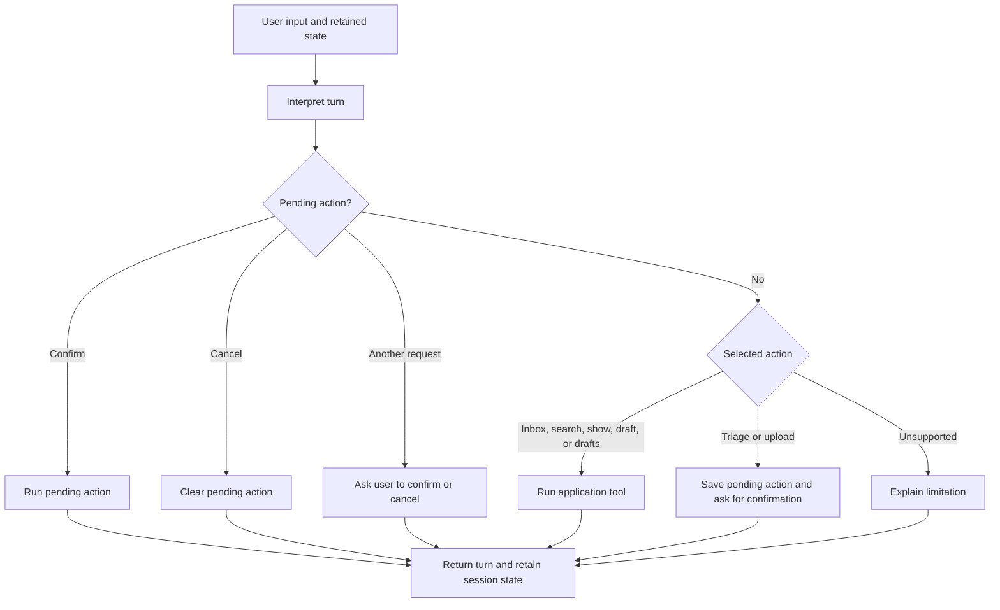

# Email Agent

Email Agent is a local assistant that triages email, searches triage summaries,
and prepares replies for review. It supports a synthetic demo mailbox, Gmail,
and IMAP. It can create mailbox drafts, but it cannot send email.

## Quick start

The demo creates a persistent mailbox of fictional Faker messages. Model-backed
features require an OpenAI API key.

```bash
uv sync --extra dev
cp .env.example .env
# Add OPENAI_API_KEY to .env
uv run email-agent demo
```

Try the complete workflow in the interactive shell:

```text
> /inbox
> /triage
> /search high priority messages
> draft a short reply to message 3
> upload that draft
```

`/help` lists all commands. Demo data remains available between runs and `/inbox`
does not create duplicate messages.

To connect a real mailbox, see [Gmail and IMAP setup](docs/configuration.md).

## How the graph works

Plain text runs through a LangGraph that selects one supported operation. Every
operation calls the same application service used by the explicit slash commands.
The graph keeps recent message references and a pending confirmation in its state.
Each graph invocation handles one user turn and then retains that state for the
next turn.

Read-only operations and local draft generation run immediately. Triage changes
mailbox labels or folders, and draft upload creates a mailbox draft, so both wait
for confirmation. No send-email tool exists.



## How search works

Search combines vector similarity with exact database filters. One structured model call separates the request
into a semantic query and explicit filters. Chroma, the vector database, uses
vector similarity search to retrieve triage-summary candidates. SQLite then
applies the filters and loads the stored messages.

```text
User query → structured search plan → Chroma vector search → SQLite filters → stored messages
```

## Design notes

- **Constrained models:** Models return validated triage, draft, search-plan, and
  assistant-intent objects. Python owns persistence, provider calls, retries, and
  confirmation.
- **One application boundary:** The CLI, interactive shell, and LangChain tools
  share the same application services instead of implementing separate workflows.
- **Explicit side effects:** Inbox, search, and local drafting run directly.
  Mailbox changes require an explicit command or conversational confirmation.
- **Incremental RAG:** Triage updates the Chroma index. Search reads the existing
  index rather than rebuilding or writing it.
- **Local-first demo:** The Faker mailbox exercises the real triage, drafting,
  search, graph, persistence, and evaluation paths without mailbox credentials.

See [Architecture](docs/architecture.md) for package boundaries and workflow
details.

## Evaluation and observability

The repository includes synthetic LangSmith datasets for triage, drafting,
search, and assistant routing:

```bash
uv run email-agent evaluate triage
uv run email-agent evaluate drafting
uv run email-agent evaluate search
uv run email-agent evaluate assistant
```

Search evaluation runs the production RAG pipeline against a temporary mailbox
and vector index. The other evaluations measure structured decisions and draft
quality. See [Development](docs/development.md) for evaluator details and
[Observability and privacy](docs/observability_and_privacy.md) before tracing
mailbox content.

## What I would improve

I would improve retrieval correctness, broaden evaluation coverage, and make the
assistant more adaptable to other business workflows. See the
[project backlog](docs/backlog.md) for the prioritized list and tradeoffs.

## Development

```bash
uv run ruff check .
uv run pytest
git diff --check
```

Additional references:

- [Interactive shell](docs/interactive_shell.md)
- [Categories and mailbox organization](docs/categories.md)
- [Gmail OAuth](docs/gmail_oauth_setup.md)
