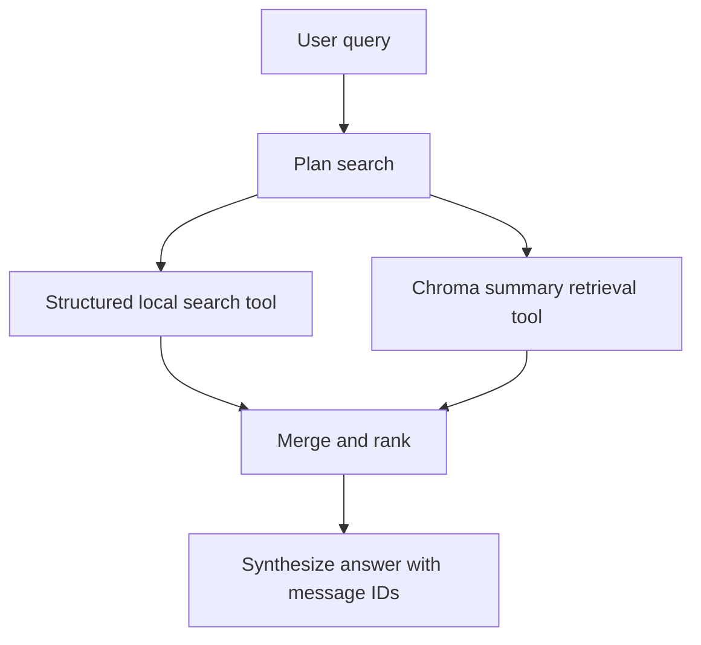

# Email Agent

Email Agent classifies recent email, organizes the mailbox, and prepares reply
suggestions for review. It can upload a suggestion to the mailbox Drafts folder,
but it cannot send email. It supports Gmail and IMAP accounts. 

## Quick start

Install the application and create a private environment file:

```bash
uv sync --extra dev
cp .env.example .env
```

Create a Gmail account from the personal template:

```bash
uv run email-agent account add you@gmail.com \
  --provider gmail \
  --template personal \
  --model-provider openai \
  --model gpt-5.4-mini
```

For Gmail, complete [Gmail OAuth setup](docs/gmail_oauth_setup.md) before the
first connection.

Validate the configuration:

```bash
uv run email-agent account validate
uv run email-agent account
```

## Use Email Agent

Start the interactive shell:

```bash
uv run email-agent
```

The shell selects the only configured account automatically. If several accounts
exist, it asks which one to use. Type `/help` to see the available slash commands.
See the [interactive shell guide](docs/interactive_shell.md) for examples.

The same workflows are available as scriptable CLI commands:

```bash
uv run email-agent inbox --account you@gmail.com
uv run email-agent classify --account you@gmail.com
uv run email-agent ask --account you@gmail.com "find recent messages related to my job search"
uv run email-agent message show 1
uv run email-agent drafts --account you@gmail.com
uv run email-agent drafts generate 1
uv run email-agent drafts review --account you@gmail.com
uv run email-agent drafts upload 1
```

Run `uv run email-agent --help` or add `--help` after a command for the current
command reference.

The `inbox` command only synchronizes and displays recent mail. It does not load
a model or change mailbox labels. Run `classify` to classify unclassified messages
and synchronize their managed labels. Generate drafts explicitly for messages
that need replies.

## Ask your inbox

Ask read-only natural language questions about synchronized and classified mail:

```bash
uv run email-agent ask "show me recent important messages"
uv run email-agent ask "find recent messages related to my job search"
uv run email-agent ask "what emails from this week need a reply?"
```

The `/ask` workflow uses LangGraph to plan the search, run read-only LangChain
tools, retrieve classified message summaries from Chroma, rank matches, and answer
with local message IDs. It searches the local cache only and does not change
mailbox labels, drafts, or messages.



Classification summaries are embedded instead of raw message bodies to reduce
PII exposure. Summaries can still contain sensitive information.

## Safety and privacy

- Email Agent does not send email.
- Draft generation creates a pending local suggestion.
- Draft upload creates a mailbox draft for review.
- Credentials and OAuth tokens are not logged.
- Exact model content is logged only when model tracing is explicitly enabled.

Read [Observability and privacy](docs/observability_and_privacy.md) before enabling
model tracing or LangSmith.

## Documentation

- [Configuration](docs/configuration.md)
- [Categories and mailbox organization](docs/categories.md)
- [Interactive shell](docs/interactive_shell.md)
- [Gmail OAuth setup](docs/gmail_oauth_setup.md)
- [Observability and privacy](docs/observability_and_privacy.md)
- [Architecture and safety boundaries](docs/architecture.md)
- [Development](docs/development.md)

## Development checks

```bash
uv run ruff check .
uv run pytest
git diff --check
```
