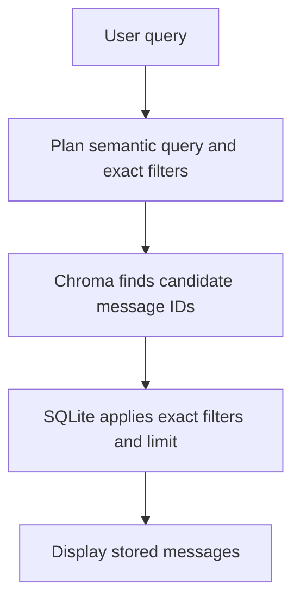
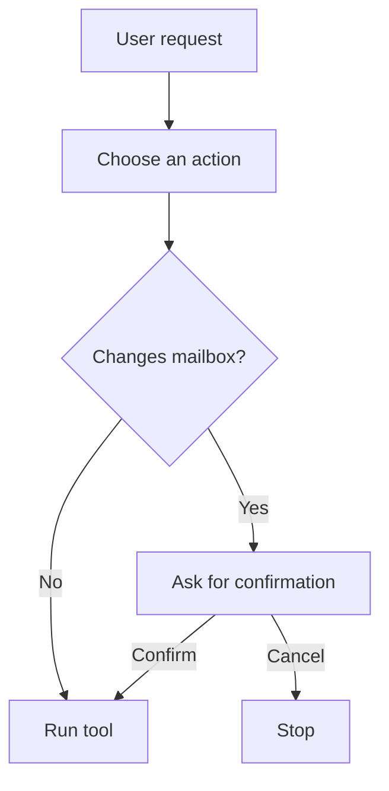

# Email Agent

Email Agent triages recent email, organizes the mailbox, and prepares reply
suggestions for review. It can upload a suggestion to the mailbox Drafts folder,
but it cannot send email. It supports Gmail and IMAP accounts plus a synthetic
local demo account.

## Quick start

Install the application and create a private environment file:

```bash
uv sync --extra dev
cp .env.example .env
```

<!-- TODO: break the 3 account type setups into separate file? -->
Create a persistent synthetic account and open its interactive shell without a
mailbox:

```bash
uv run email-agent demo
```

The first run creates a persistent mailbox of fictional Faker messages. `/inbox`
reads its newest 20 messages by default, or the requested limit, without creating
duplicates. Messages are ordered by received time, newest first.
Triage, drafting, search, and the conversational LangGraph use the configured
OpenAI model and require `OPENAI_API_KEY`. Try plain requests such as `fetch my
latest messages`, `find messages that need a reply`, and `draft a short reply to
message 3`. The explicit slash commands remain available.

Create a Gmail account from the personal template:

```bash
uv run email-agent account add you@gmail.com \
  --provider gmail \
  --template personal \
  --model-provider openai \
  --model gpt-5.4-mini
```

For Gmail, complete [Gmail OAuth setup](docs/gmail_oauth_setup.md) before the
first connection.

Validate the configuration:

```bash
uv run email-agent account validate
uv run email-agent account
```

## Use Email Agent

Start the interactive shell:

```bash
uv run email-agent
```

The shell selects the only configured account automatically. If several accounts
exist, it asks which one to use. Type `/help` to see the available slash commands.
See the [interactive shell guide](docs/interactive_shell.md) for examples.

The same workflows are available as scriptable CLI commands:

```bash
uv run email-agent inbox --account you@gmail.com
uv run email-agent triage --account you@gmail.com
uv run email-agent search --account you@gmail.com "find recent messages related to my job search"
uv run email-agent message show 1
uv run email-agent drafts --account you@gmail.com
uv run email-agent drafts generate 1
uv run email-agent drafts review --account you@gmail.com
uv run email-agent drafts upload 1
```

Run `uv run email-agent --help` or add `--help` after a command for the current
command reference.

The `inbox` command only synchronizes and displays recent mail. It does not load
a model or change mailbox labels. Run `triage` to triage untriaged messages
and synchronize their managed labels. Generate drafts explicitly for messages
that need replies.

## Search your inbox

Search synchronized and triaged mail with natural language queries:

```bash
uv run email-agent search "show me recent important messages"
uv run email-agent search "find recent messages related to my job search"
uv run email-agent search "what emails from this week need a reply?"
```

`/search` uses one model call to split the request into a semantic query and any
exact filters the user requested. Chroma finds candidate message IDs from the
semantic query. SQLite applies the exact filters
and enforces the result limit. The workflow then displays those stored messages;
it does not ask a model to rewrite or select the results.

For example, `find the exposed credentials message` is a semantic search. In
`show urgent messages about credentials`, `credentials` is the semantic query
and `urgent` is an exact priority filter. Exact filters are used only when the request states them.



Triage summaries are embedded instead of raw message bodies to reduce
PII exposure. Summaries can still contain sensitive information. The Chroma index
is synchronized incrementally by `triage`, so unchanged messages are not
embedded again. `/search` reads the existing Chroma index and SQLite cache. It
does not change mailbox labels, drafts, or messages.

## Conversational assistant

Plain text in the interactive shell runs through a LangGraph. The graph chooses
one supported action and calls the same application code as the slash commands.
Actions that do not change the mailbox run immediately. Triage and draft upload
wait for confirmation. The assistant cannot send email.

Evaluate its routing and confirmation policy with
`uv run email-agent evaluate assistant --profile personal`.



The confirmation boundary is a mailbox change. Triage requires confirmation
because it saves the analysis and synchronizes the configured Gmail label or
IMAP folder. Draft generation stays local and runs immediately; uploading that
draft changes the mailbox and requires confirmation.

## Safety and privacy

- Email Agent does not send email.
- Draft generation creates a pending local suggestion.
- Draft upload creates a mailbox draft for review.
- Credentials and OAuth tokens are not logged.
- Exact model content is logged only when model tracing is explicitly enabled.

Read [Observability and privacy](docs/observability_and_privacy.md) before enabling
model tracing or LangSmith.

## Documentation

- [Configuration](docs/configuration.md)
- [Categories and mailbox organization](docs/categories.md)
- [Interactive shell](docs/interactive_shell.md)
- [Gmail OAuth setup](docs/gmail_oauth_setup.md)
- [Observability and privacy](docs/observability_and_privacy.md)
- [Architecture and safety boundaries](docs/architecture.md)
- [Development](docs/development.md)

## Development checks

```bash
uv run ruff check .
uv run pytest
git diff --check
```
